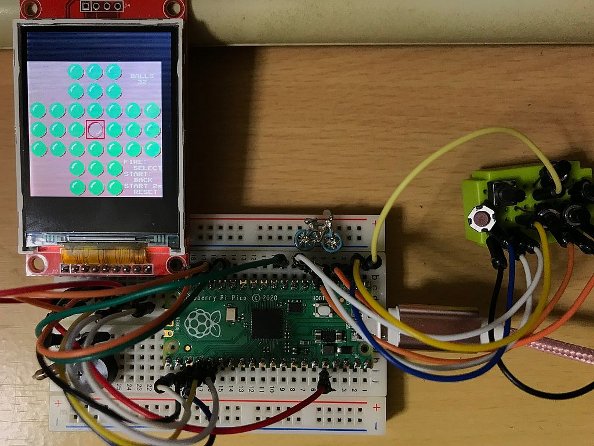

# ペグソリテア Peg-Solitaire for Raspberry Pi Pico
ペグソリテアと呼ばれる一人遊びゲームをラズベリーPi Pico＋QVGA液晶用に作成しました。  
とてもシンプルな回路なので、簡単に製作することができます。  
液晶は240x320ドット、コントローラにILI9341を搭載したSPI接続のものに対応しています。  
  
## 実行方法
ラズベリーPi PicoのBOOTSELボタンを押しながらPCのUSBポートに接続し、バイナリーファイル pegsolpico.uf2 をラズベリーPi Picoにコピーしてください。  
  
## 遊び方
32個の玉が十字形に並んでいて、真ん中に一つだけ玉のない穴があります。玉は一つ隣の玉を飛び越して空いている穴に動かすことができます。飛び越された玉は消えます。飛び越した先に玉があってはいけません。これを繰り返し、最後に玉を一つだけ残して消すことができれば成功です。  
まず、方向ボタンで赤い枠を動かして移動させたい玉を選択し、FIREボタンを押すと赤枠が緑になります。次に移動させたい場所に赤枠を動かし、再度FIREボタンを押すと玉が移動し、飛び越された玉は消えます。正しくない動かし方をした場合、無効となります。  
STARTボタンを押すと、一手前の状態に戻すことができます。再度STARTボタンを押すとさらに前の状態に戻ります。また、STARTボタンを2秒以上押すと、最初の状態にリセットされます。  
  
## ソースプログラムのビルド方法
ソースプログラムのビルドにはRP2040に対応したコンパイラの他、CMake、pico-sdkが必要です。  
SDKが使用できる環境設定をした上で、ダウンロードした拡張子が.c .h .txt .cmakeのファイルを同じフォルダに入れてビルドしてください。  
  
  